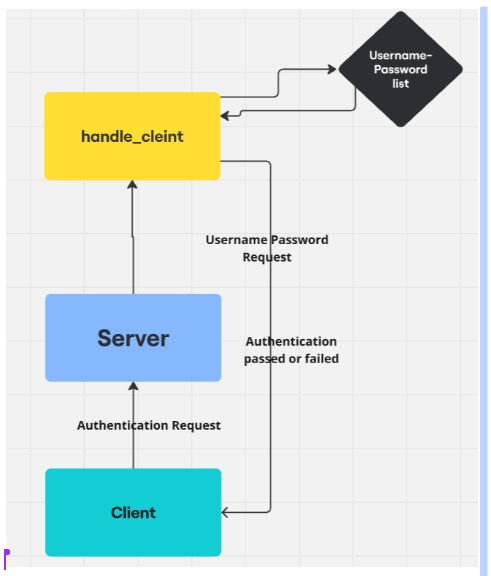
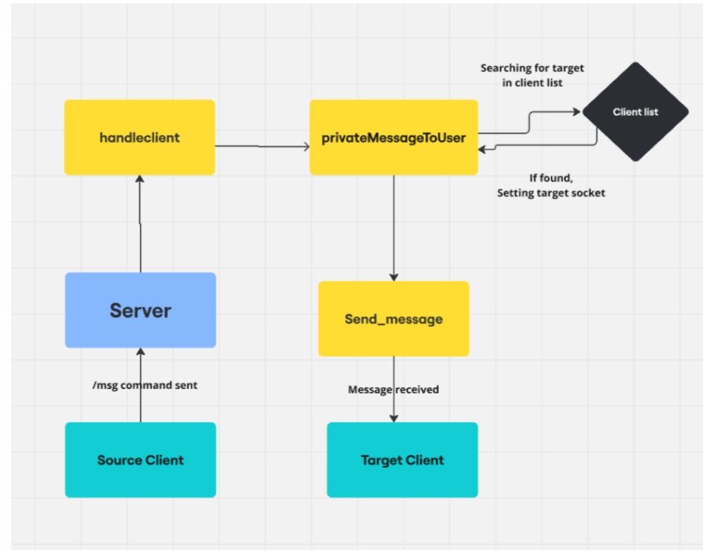

# Assignment 1  
## CS 424: Computer Networks  

---

## Team Members  
- **Ashish Patidar** - 210215  
- **Vibhansh Bhatia** - 211161  
- **Utkarsh Agrawal** - 211127  

---

## Overview  
This is a multi-threaded chat server written in C++. The server enables clients to communicate with each other through private messages, group chats, and broadcast messages. The server handles user authentication, group management, and message routing using TCP sockets.  

---

## Instructions to Compile and Run the Server  

1. Use any Linux kernel for testing the code.  
2. Open the terminal and write the command **`make`**. This compiles both the client and the server.  
3. Now, in the terminal, type the command **`./server_grp`**. This starts the server.  
4. Now split the terminal and type the command **`./client_grp`** to run the client.  

---

## Features  

- **User Authentication**: Users are required to log in with a username and password stored in a `users.txt` file.  
- **Broadcast Messaging**: Clients can send messages to all connected users.  
- **Private Messaging**: Clients can send direct messages to specific users.  
- **Group Messaging**: Clients can create, join, leave, and message groups.  
- **Thread-Safe Multi-threading**: Each client connection is handled by a separate thread, ensuring concurrent communication.  
- **Error Handling**: Throws an error message when an invalid command is used.  

---

## Design Decisions  

### Multi-threading Model  
- The server creates a new thread for each client connection (`std::thread`).  
- This allows multiple clients to communicate simultaneously without blocking the server.  

### Data Synchronization  
- Since multiple threads access shared resources such as the client list and group mappings, `std::mutex` and `std::lock_guard<std::mutex>` are used to prevent race conditions.  
- This ensures:  
  - **Thread Safety**: Only one thread modifies shared data at a time.  
  - **Consistency**: Prevents data corruption when multiple clients interact with the server simultaneously.  

---

## Group Membership Management  
- Standard commands are implemented to allow a client to create a group, join a group, send messages to group members, and leave a group.  
- Appropriate broadcast messages are added wherever required.  
- The implementation ensures that only active clients are part of a group.  
- The server iterates through all groups and removes disconnected clients’ sockets.  

---

## Handling Multiple Logins  
- If a user is already active (i.e., the socket is already allotted to a user), an error message is thrown when the same user tries to log in from a different terminal.  

---

## High-Level Overview of Important Functions  

### 1. Server Initialization (main function)  
- Loads user credentials from `users.txt` into an unordered map.  
- Creates a TCP socket using `socket(AF_INET, SOCK_STREAM, 0)`.  
- Binds the socket to port **12345**.  
- Listens for incoming client connections (`listen(server_socket, 10)`).  
- Accepts new client connections in a loop.  
- Creates a new thread to handle each client connection (`std::thread t(handle_client, client_socket)`).  

### 2. Client Handling (handle_client function)  
- Prompts the client for authentication credentials.  
- If valid, adds the username to a global client list (protected by a mutex).  
- A while-loop continuously listens for messages from the client to maintain real-time communication.  
- When a client disconnects, the server removes them from the global client list and any groups they were part of.  

### 3. Message Processing (handleCommands function)  
#### Broadcast Messages (`/broadcast <message>`)  
- Sent to all connected users except the sender.  
- Implemented using `broadcastMessageToAllUsers()`, which iterates through the clients list and sends messages over the corresponding sockets.  

#### Private Messages (`/msg <username> <message>`)  
- Searches the global client list for the recipient.  
- Uses `privateMessageToUser()` to deliver the message.  
- If the recipient is offline, a notification is sent back to the sender.  

#### Group Management  
- **Create Group** (`/create_group <groupname>`): Initializes a new group with the creator as the first member.  
- **Join Group** (`/join_group <groupname>`): Checks if the group exists and adds the user. A notification is sent to all members.  
- **Leave Group** (`/leave_group <groupname>`): Removes the user from the group. If the group becomes empty, it is deleted.  
- **Send Group Message** (`/group_msg <groupname> <message>`): Sends the message to all group members.  

---

## Synchronization & Thread Safety  
- Since multiple clients can connect simultaneously, shared resources (client list and groups list) must be protected.  
- The server uses:  
  - **Mutex Locks (`std::mutex`)** to prevent data races.  
  - **Lock Guards (`std::lock_guard<std::mutex>`)** to automatically release locks when the function scope exits.  

---

## Testing  
- For stress testing, we ran a Python script to simulate multiple client login requests.  

---

## Challenges Faced and Solutions  

- **Choosing the right libraries** for different purposes on Linux took time.  
- **Multi-threading** was new to our team.  
  - We started by looking at the given hint in the assignment, understanding `lock_guard` and `mutex`.  
  - After reading online resources, we successfully implemented thread synchronization.  

---

## Restrictions in the Server  

| Feature | Limitation |
|---------|-----------|
| Maximum Clients (Simultaneous) | ~28 users (no delay) |
| Maximum Clients (With 0.01s delay) | >5000 users (without broadcast), ~184 users (with broadcast) |
| Maximum Message Length | 1024 bytes (including command length) |
| Maximum Groups | Over 2,000,000 (depends on `unordered_map` memory limit) |
| Maximum Members per Group | At least 10,000 (can reach ~1,000,000 based on `unordered_set<int>`) |

- **Multiple login checking increases complexity**, reducing concurrent connections.  
- **Broadcasting join/leave messages** adds load on the server.  

---

## Individual Contributions  

- **Ashish Patidar:**  
  - Brainstormed the basic framework.  
  - Implemented server connection setup.  
  - Developed multi-threading and client handling functions.  

- **Vibhansh Bhatia:**  
  - Brainstormed the basic framework.  
  - Implemented personal messaging and broadcasting functions.  
  - Worked on stress-testing the server.  

- **Utkarsh Agrawal:**  
  - Brainstormed the basic framework.  
  - Implemented group-related commands.  
  - Prepared the README document.  

---

## Sources  

1. [Mutex in C++ Threads](https://medium.com/@abhishekjainindore24/mutex-in-c-threads-part-1-45aeac3ab62d)  
2. [Mutex Lock for Linux Thread Synchronization](https://www.geeksforgeeks.org/mutex-lock-for-linux-thread-synchronization/)  
3. [C++ Multi-threading Tutorial](https://youtu.be/cNdlrbZSkyQ)  
4. [YouTube Playlist on Multi-threading](https://www.youtube.com/playlist?list=PLk6CEY9XxSIAeK-EAh3hB4fgNvYkYmghp)  

---

## Declaration  
We, the members of the team submitting this assignment, declare that we did not indulge in any plagiarism. The work was produced by the team members themselves, and appropriate citations are added wherever required.  

---

## Feedback  
- Working with **multi-threading** was a challenge.  
- We were unfamiliar with **relevant libraries** for implementation.  
- **In-class discussions** on these aspects would be helpful for students.  
